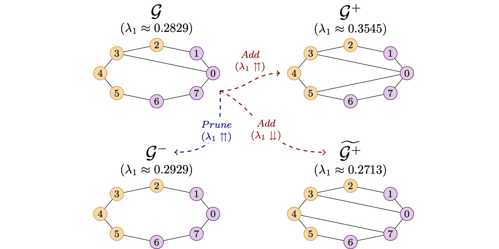

# SpectralPruningBraess
This is the code base for our recently proposed spectral based graph rewiring for mitigating both oversquashing and oversmoothing.





Special thanks to my collaborator [Celia](https://github.com/celrm) for the ring diagrams :P.


Requirements

```
Pytorch-Geometric
Pytorch
Networkx
```

To run the code -

```Python
python main.py --dataset 'Cora' --method 'proxydelmin' --max_iters 50 --out 'Planetoid.csv' --existing_graph None
```

Supports -

1. Rewiring using proxyaddmin,proxyaddmax,proxydelmin,proxydelmax. Add/Delete edges to either maximize or minimize the spectral gap.
2. Rewiring using FoSR. Adds edges to maximize spectral gap. (https://github.com/kedar2/FoSR)
3. Rewiring using SDRF. Rewires the graph based on discrete Ricci curvature. (https://github.com/jctops/understanding-oversquashing)

For experiments on larger heterophilic datasets - use the code base from - https://github.com/yandex-research/heterophilous-graphs requires DGL. Change the datasets.py to include the rewiring scheme.

For experiments on long range graphbenchmark - use the code base from - https://github.com/toenshoff/LRGB 


